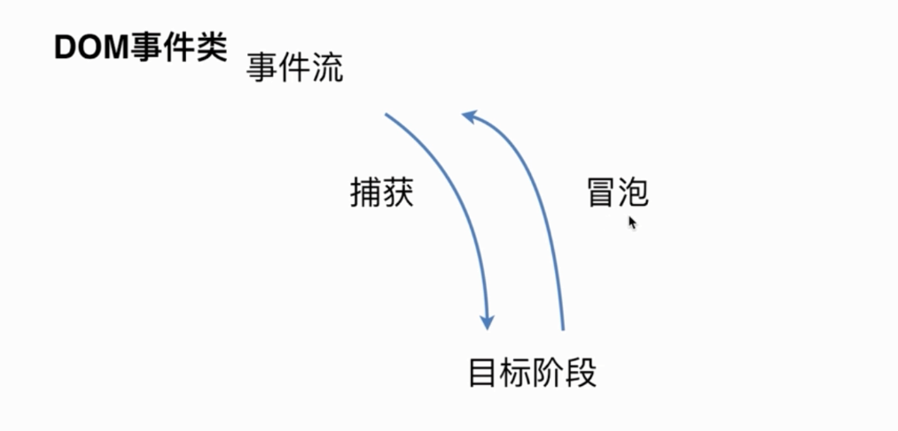
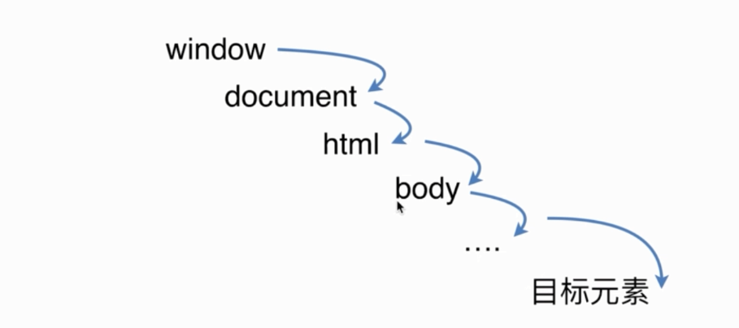
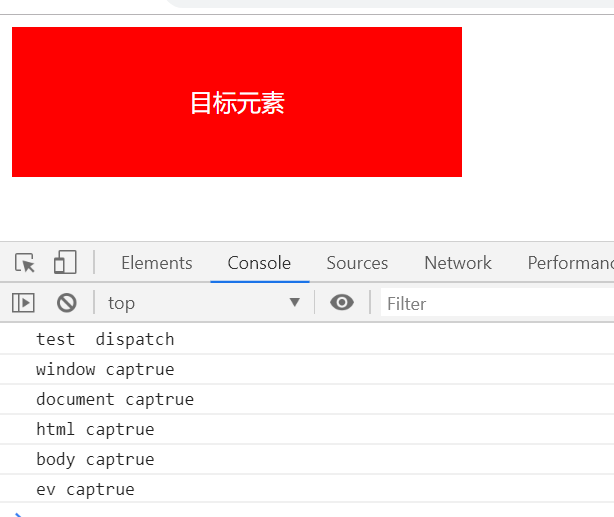
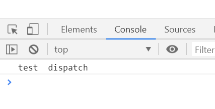

# DOM事件机制

- 基本概念： DOM事件的级别
- DOM事件模型 捕获 冒泡
- DOM事件流
- 描述DOM事件捕获的具体流程
- Event对象的常见应用
- 自定义事件

## 事件级别

```javascript
// DOM0 
element.onclick= function(){}
// DOM2 
element.addEventListener('click', function(){}, false)
// DOM3 
element.addEventListener('keyup',functoin(){}, false)
```
## 事件模型


- 捕获
- 冒泡
- 事件流
一个完整的事件流分为三个阶段，
	- 第一阶段是捕获
	- 第二阶段事件通过捕获到达目标元素这就是目标阶段，
	- 第三个阶段就是从目标元素上传到window对象，这就是冒泡的过程

事件捕获阶段：事件从最上一级标签开始往下查找，直到捕获到事件目标(target)。

事件冒泡阶段：事件从事件目标(target)开始，往上冒泡直到页面的最上一级标签。
## 描述dom事件捕获的具体流程

​	window> document> html> body> 父元素>子元素

```html
  <div id="ev">
    <style>
    #ev {
      width: 300px;
      height: 100px;
      background: red;
      color: #fff;
      text-align: center;
      line-height: 100px;
    }
    </style>
    目标元素
  </div>
```
```javascript

var ev = document.getElementById('ev')
  window.addEventListener('click', function(){
    console.log('window captrue')
  }, true); // true 捕获 false 、、 冒泡

  document.addEventListener('click', function(){
    console.log('document captrue')
  },true)

  document.documentElement.addEventListener('click', function(){
    console.log('html captrue')
  }, true)

  document.body.addEventListener('click', function(){
    console.log('body captrue')
  },true)

  ev.addEventListener('click', function(){
    console.log('ev captrue')
  }, true)

  //自定义事件
  var eve = new Event('test');
  ev.addEventListener('test', function(){
    console.log('test  dispatch')
  })
  setTimeout(() => {
    ev.dispatchEvent(eve)
  }, 1000);
```
和事件冒泡相反，事件捕获是自上而下执行，我们只需要将addEventListener的第三个参数改为true就行。

## event对象的常见应用

```javascript
event.prentDafault() // 阻止默认事件
event.stopPropagation() // 阻止冒泡
event.stopImmediatePropagation() 
// 阻止事件冒泡并且阻止相同事件的其他侦听器被调用
// 如果有多个相同类型事件的事件监听函数绑定到同一个元素，当该类型的事件触发时，
// 它们会按照被添加的顺序执行。如果其中某个监听函数执行了 event.stopImmediatePropagation() 方法，
// 则当前元素剩下的监听函数将不会被执行。
 event.currentTarget() 
// 当前被绑定的事件

// 指的是绑定了事件监听的元素（可以理解为触发事件元素的父级元素）

// w3c
// currentTarget 事件属性返回其监听器触发事件的节点，即当前处理该事件的元素、文档或窗口。
//在捕获和起泡阶段，该属性是非常有用的，因为在这两个节点，它不同于 target 属性。
  event.target()
// 指的是真正触发事件的那个元素
// w3c 
// target 事件属性可返回事件的目标节点（触发该事件的节点），如生成事件的元素、文档或窗口
```

- 面试中会隐含问你current和target的区别
事件委托,
如：一个for循环给dom注册了n多事件，你怎么优化？
用事件代理，将子元素的事件绑定到父元素上，做响应的时候，判断当前的是哪个子元素被点击，使用target来判断
target值当前被点击的元素
currentTarget
当前被绑定的事件， 例子中指的是被绑定事件的父级元素

```javascript
var eve = new Event('custome');
ev.addEventListener('custome', function(){
	console.log('custome')
})
ev.dispatchEvent(eve);
```

## 自定义事件

```javascript
  var eve = new Event('test');
  ev.addEventListener('test', function(){
    console.log('test  dispatch')
  })
  setTimeout(() => {
    ev.dispatchEvent(eve)
  }, 1000);
```
一秒钟后打印



CustomEvent