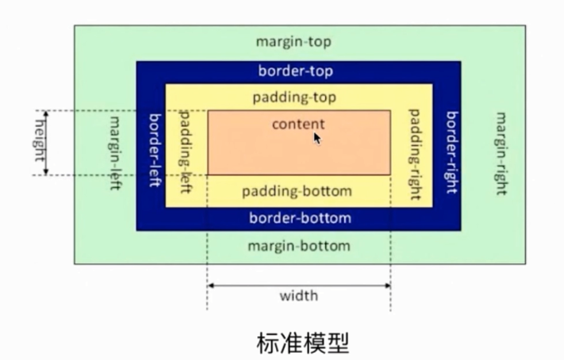
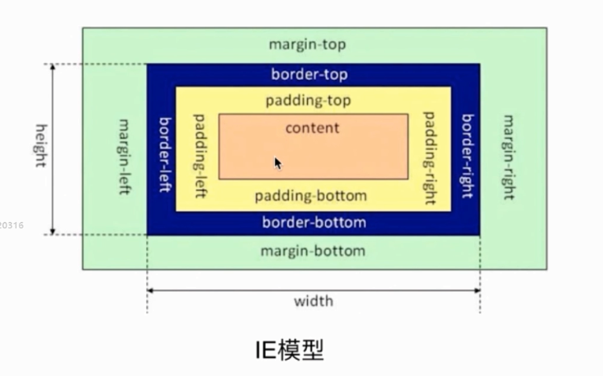
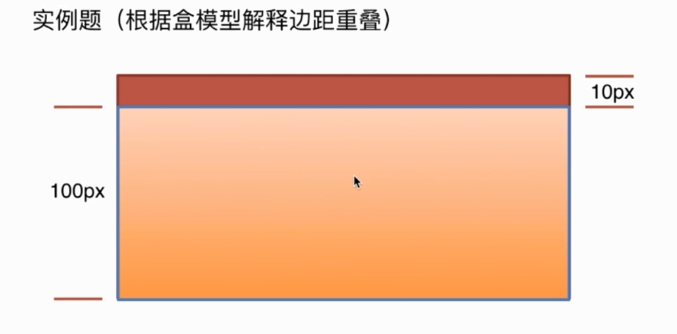

# 深入理解CSS盒模型

谈谈你对css盒模型的认识
- 基本概念 标准模型+IE模型
- 标准模型和IE模型区别
- css是如何设置这两种模型
- js如何设置获取盒模型对应的宽和高
- 实例题 根据盒模型解决边距重叠
- BFC (边距重叠解决方案)
### 基本概念
盒模型的组成大家肯定都懂，由里向外content,padding,border,margin。
盒模型是有两种标准的，一个是标准模型，一个是IE模型。



标准模型和IE模型的区别
- 计算高度和宽度的不同
盒模型的宽高只是内容（content）的宽高，
而在IE模型中盒模型的宽高是内容(content)+填充(padding)+边框(border)的总宽高。
### css 盒模型
css 如何设置这两种模型
css3的box-sizing属性
```css
	box-sizing: content-box; 浏览器默认 标准模型
	box-sizing: border-box; IE模型
```

### js如何设置获取盒模型对应的宽和高

```javascript
	dom.style.width/height
	// 只能取内联样式的宽和高
	dom.currentStyle.width/height
	// 浏览器渲染以后获取的宽和高 只支持IE
	window.getComputedStyle(dom).width/height // 兼容性更好
	// 通用性更好
	dom.getBoundingClientRect().width/height
	// 计算一个元素的绝对位置， 这个绝对位置是根据视窗左侧开始
```

### 实例题 根据盒模型解决边距重叠



子元素100px高度 设置margin-top:10px; 这时父元素的实际高度是？
100和110都对，要看盒模型
标准100 ie110

### 什么是边距重叠
父元素没有设置margin-top，而子元素设置了margin-top：20px;可以看出，父元素也一起有了边距

### 解决边距重叠的方案BFC
父子元素边距重叠，给父元素加overflow：hidden创建BFC

#### BFC 概念
块级格式化上下文
### BFC 原理

1. 在BFC这个元素垂直方向边距会发生重叠
2. BFC的区域不会与浮动的元素的box重叠 应用清除浮动
3. BFC在页面中是一个独立的容器，里面和外面的元素不会互相影响
4. 计算BFC高度的时候，浮动元素也会参与计算

### 怎么创建BFC

- float属性不为none（脱离文档流）
- position的值只要不是static和relative, 设置为为absolute或fixed
- display为inline-block,table-cell,table-caption,flex,inine-flex
- overflow不为visible
- 根元素

