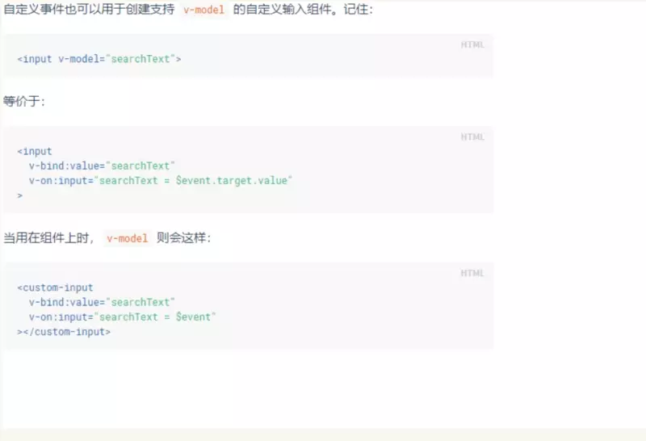
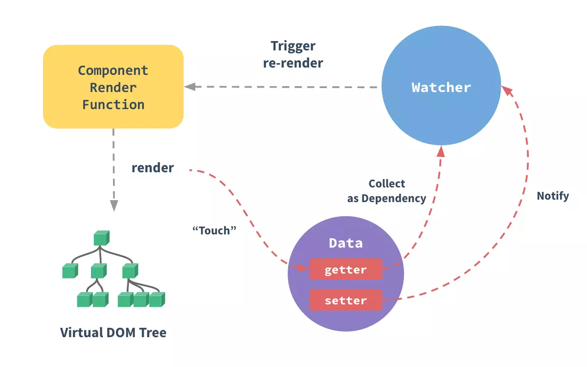

# 很全面的vue面试题总结
1. v-show 与 v-if 区别
2. 动态绑定class的方法
3. 计算属性和 watch 的区别
4. 怎样理解单向数据流
5. keep-alive
6. 自定义组件的语法糖 v-model 是怎样实现的
7. 生命周期
8. 组件通信
9. 路由跳转
10. vue-router 有哪几种导航钩子
11. Vue.js 2.x 双向绑定原理
12. 什么是 MVVM，与 MVC 有什么区别
13. vuex
14. this.$nextTick()
15. vue的原理
16. 理解Vue中的Render渲染函数
17. slot插槽
## v-show 与 v-if 区别
1. v-hsow和v-if的区别：
    v-show是css切换，v-if是完整的销毁和重新创建。
2. 使用
    频繁切换时用v-show，运行时较少改变时用v-if
3. v-if=‘false’ v-if是条件渲染，当false的时候不会渲染
## 绑定 class 的数组用法
- 对象方法 `v-bind:class="{'orange': isRipe, 'green': isNotRipe}"`
- 数组方法  `v-bind:class="[class1, class2]"`
- 行内 `v-bind:style="{color: color, fontSize: fontSize+'px' }"`
## 计算属性和 watch 的区别
计算属性是自动监听依赖值的变化，从而动态返回内容，监听是一个过程，在监听的值变化时，可以触发一个回调，并做一些事情。
所以区别来源于用法，只是需要动态值，那就用计算属性；需要知道值的改变后执行业务逻辑，才用 watch，用反或混用虽然可行，但都是不正确的用法。

**说出一下区别会加分**

computed 是一个对象时，它有哪些选项？
computed 和 methods 有什么区别？
computed 是否能依赖其它组件的数据？
watch 是一个对象时，它有哪些选项？
1. 有get和set两个选项
2. methods是一个方法，它可以接受参数，而computed不能，computed是可以缓存的，methods不会。
3. computed可以依赖其他computed，甚至是其他组件的data
4. watch 配置 

handler
deep 是否深度
immeditate 是否立即执行

**总结**

当有一些数据需要随着另外一些数据变化时，建议使用computed。
当有一个通用的响应数据变化的时候，要执行一些业务逻辑或异步操作的时候建议使用watcher
## 事件修饰符
- 绑定一个原生的click事件， 加native， 
- 其他事件修饰符  
stop prevent  self
- 组合键
click.ctrl.exact 只有ctrl被按下的时候才触发
## 组件中 data 为什么是函数
> 为什么组件中的 data 必须是一个函数，然后 return 一个对象，而 new Vue 实例里，data 可以直接是一个对象？

因为组件是用来复用的，JS 里对象是引用关系，这样作用域没有隔离，而 new Vue 的实例，是不会被复用的，因此不存在引用对象的问题。
## keep-alive
https://cn.vuejs.org/v2/guide/components-dynamic-async.html#%E5%9C%A8%E5%8A%A8%E6%80%81%E7%BB%84%E4%BB%B6%E4%B8%8A%E4%BD%BF%E7%94%A8-keep-alive
## 自定义组件的语法糖 v-model 是怎样实现的
https://www.cnblogs.com/attacking-cabbage/p/10260393.html

  根据官方文档介绍，v-model本质上就是语法糖，即利用v-model绑定数据后，其实就是既绑定了数据，又添加了一个input事件监听，如下：



## 怎样理解单向数据流
这个概念出现在组件通信。父组件是通过 prop 把数据传递到子组件的，但是这个 prop 只能由父组件修改，子组件不能修改，否则会报错。子组件想修改时，只能通过 $emit 派发一个自定义事件，父组件接收到后，由父组件修改。
一般来说，对于子组件想要更改父组件状态的场景，可以有两种方案：
在子组件的 data 中拷贝一份 prop，data 是可以修改的，但 prop 不能：
```javascript
export default {
  props: {
    value: String
  },
  data () {
    return {
      currentValue: this.value
    }
  }
}
```

如果是对 prop 值的转换，可以使用计算属性：
```javascript
export default {
  props: ['size'],
  computed: {
    normalizedSize: function () {
      return this.size.trim().toLowerCase();
    }
  }
}
```

## 生命周期
- 创建前后 beforeCreate/created 

    在beforeCreate 阶段，vue实例的挂载元素el和数据对象data都为undefined，还未初始化。在created阶段，vue实例的数据对象有了，el还没有。
- 载入前后 beforeMount/mounted 

    在beforeMount阶段，vue实例的$el和data都初始化了，但还是挂载之前未虚拟的DOM节点，data尚未替换。 
    在mounted阶段，vue实例挂载完成，data成功渲染。
- 更新前后 beforeUpdate/updated 

    当data变化时，会触发beforeUpdate和updated方法。这两个不常用，不推荐使用。
- 销毁前后beforeDestory/destoryed 
  
    beforeDestory是在vue实例销毁前触发，一般在这里要通过removeEventListener解除手动绑定的事件。实例销毁后，触发的destroyed。
## 组件间的通信
1. 父子 `props`/`event`   `$parent`/`$children`    `ref`   `provide`/`inject`
2. 兄弟  bus vuex
3. 跨级 bus  vuex provide inject
## 路由的跳转方式
一般有两种
1. `<router-link to='home'> router-link`标签会渲染为`<a>`标签，咋填template中的跳转都是这种；
2. 另一种是编程是导航  也就是通过js跳转  比如  `router.push('/home')`
## Vue.js 2.x 双向绑定原理
这个问题几乎是面试必问的，回答也是有深有浅。基本上要知道核心的 API 是通过 `Object.defineProperty()` 来劫持各个属性的` setter / getter`，在数据变动时发布消息给订阅者，触发相应的监听回调，这也是为什么 Vue.js 2.x 不支持 IE8 的原因（IE 8 不支持此 API，且无法通过 polyfill 实现）。
https://cn.vuejs.org/v2/guide/reactivity.html
## 什么是 MVVM，与 MVC 有什么区别
http://www.ruanyifeng.com/blog/2015/02/mvcmvp_mvvm.html
## nextTick()
在下次 DOM 更新循环结束之后执行延迟回调。在修改数据之后，立即使用这个回调函数，获取更新后的 DOM。
```
// 修改数据
vm.msg = 'Hello'
// DOM 还未更新
Vue.nextTick(function () {
  // DOM 更新
})
```
## vue的原理
https://segmentfault.com/a/1190000016434836

<!--  -->
Vue的模式是m-v-vm模式，即（`model-view-modelView`），通过modelView作为中间层（即vm的实例），进行双向数据的绑定与变化。
1. 通过建立虚拟dom树`document.createDocumentFragment()`,方法创建虚拟dom树。
2. 一旦被监测的数据改变，会通过`Object.defineProperty`定义的数据拦截，截取到数据的变化。
3. 截取到的数据变化，从而通过订阅——发布者模式，触发`Watcher`（观察者）,从而改变虚拟dom的中的具体数据。
4. 最后，通过更新虚拟dom的元素值，从而改变最后渲染dom树的值，完成双向绑定
双向绑定的实现
```javascript
object.defineProperty 方法会直接在一个对象上定义一个新属性，或者修改一个对象的现有属性， 并返回这个对象。
语法：Object.defineProperty(obj, prop, descriptor)

var obj = {};
Object.defineProperty(obj,'hello',{
  get:function(){
    //我们在这里拦截到了数据
    console.log("get方法被调用");
  },
  set:function(newValue){
    //改变数据的值，拦截下来额
    console.log("set方法被调用");
  }
});
obj.hello//输出为“get方法被调用”，输出了值。
obj.hello = 'new Hello';//输出为set方法被调用，修改了新值
```
我们可以做到数据的双向绑定：
```javascript
var obj = {};
Object.defineProperty(obj,'hello',{
  get:function(){
    //我们在这里拦截到了数据
    console.log("get方法被调用");
  },
  set:function(newValue){
    //改变数据的值，拦截下来额
    console.log("set方法被调用");
    document.getElementById('test').value = newValue;
    document.getElementById('test1').innerHTML = newValue;
  }
});
//obj.hello;
//obj.hello = '123';
document.getElementById('test').addEventListener('input',function(e){
  obj.hello = e.target.value;//触发它的set方法
})
```
## 理解Vue中的Render渲染函数
https://www.cnblogs.com/tugenhua0707/p/7528621.html

VUE一般使用template来创建HTML，然后在有的时候，我们需要使用javascript来创建html，这时候我们需要使用render函数。

render函数return一个createElement组件中的子元素存储在组件实列中 `$slots.default` 中。

`return createElement('h1', this.title)`; `createElement`返回的是包含的信息会告诉VUE页面上需要渲染什么样的节点及其子节点。我们称这样的节点为虚拟DOM，可以简写为VNode。
#### createElement 参数
```
{String | Object | Function}
```
 一个HTML标签字符串，组件选项对象，或者一个返回值类型为String/Object的函数。该参数是  必须的
#### 子节点
子节点，可选，String 或 Array
```javascript
Vue.component('anchored-heading', {
  render: function (createElement) {
    return createElement(
      'h' + this.level,   // 标签名称
      this.$slots.default // 由子节点构成的数组
    )
  },
  props: {
    level: {
      type: Number,
      required: true
    }
  }
})
```
## slot插槽
https://www.jianshu.com/p/31674b727954

https://vue.docschina.org/v2/guide/components-slots.html#%E4%BD%9C%E7%94%A8%E5%9F%9F%E6%8F%92%E6%A7%BD-scoped-slots 

#### 单个插槽
当子组件模板只有一个没有属性的插槽时，父组件传入的整个内容片段将插入到插槽所在的 DOM 位置，并替换掉插槽标签本身。
最初在 `<slot> `标签中的任何内容都被视为备用内容。备用内容在子组件的作用域内编译，并且只有在宿主元素为空，且没有要插入的内容时才显示备用内容。

solt元素可以用一个特殊的特性name来进一步配置如何分发内容。多个插槽可以有不同的名字。
这样可以将父组件模板中 slot 位置，和子组件 slot 元素产生关联，便于插槽内容对应传递
#### 作用域插槽scoped slots

可以访问组件内部数据的可复用插槽(reusable slot)
在父级中，具有特殊特性 `slot-scope` 的`<template>` 元素必须存在，表示它是作用域插槽的模板。slot-scope 的值将被用作一个临时变量名，此变量接收从子组件传递过来的 prop 对象。
