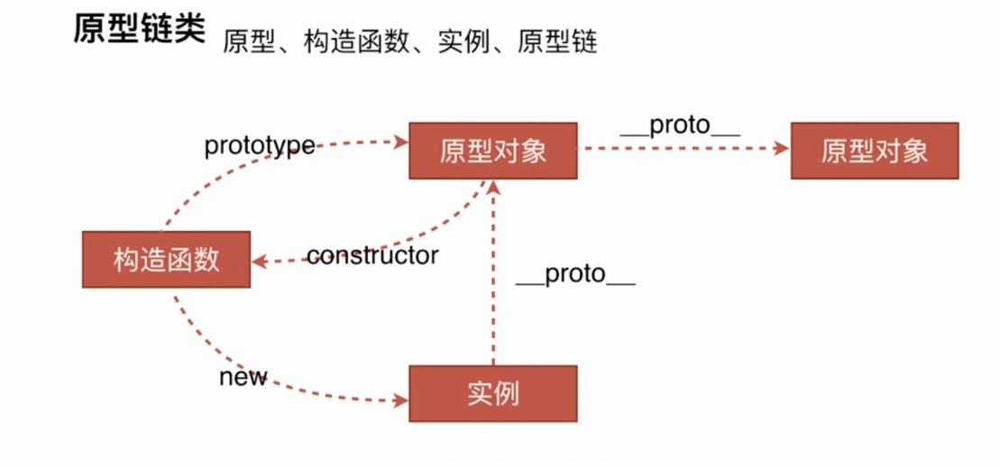
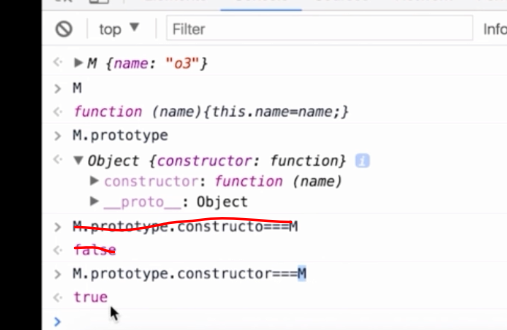
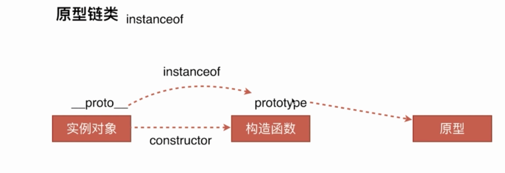
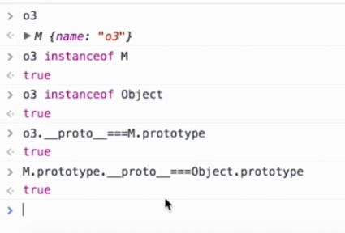
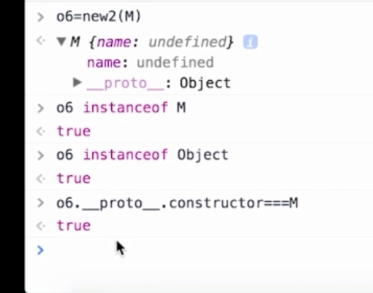

# 深入理解js原型链
- 创建对象由几种方法
- 原型、构造函数、实例、原型链
- instanceof的原理
- new运算符

### 创建对象由几种方法

```javascript
// 第一种方式： 字面量
    var o1={name: 'o1'};
    var o2=new Object({name: 'o2'});
// 第二种方式：通过构造函数
    var M=function(name){
      this.name=name;
    }
    var o3=new M('o3');

// 第三种方式： object.create
    var p={name: 'p'};
    var o4=Object.create(p);
```


- 构造函数和实例的关系
使用new 运算符的就是构造函数。

构造函数可以使用new运算符来生产一个实例。

构造函数也是函数，任何函数都可以当做构造函数，只要使用new操作符，就是构造函数。
函数都有一个prototype属性，这个prototype指的就是原型对象。
原型对象怎么区分出我是被那个构造函数所引用，是构造器。原型对象中有一个构造器constructor，默认指向所声明的那个函数。

```javascript
// 构造函数和原型的关系
M.prototype.constructor===M  // true
```


- 原型对象和构造函数的关系




```javascript
实例和原型对象的关系
o3.__proto__===M.prototype  //true
```

## 原型链

就是从一个实例对象往上找，构造这个实例相关联的对象，然后这个关联的对象再往上找，它又有创造它的上一级的原型对象，以此类推，一直到object.prototype，原型对象终止。

object.prototype是原型链的顶端，到那就截止了。

原型链是通过什么实现向上找的过程？

是通过prototype这个原型和`__proto__`属性，来完成原型链的查找。


### 原型对象和原型链之间起了什么样的作用？
```javascript
  var M=function(name){
      this.name=name;
    }
    var o3=new M('o3');
    
    M.prototype.say=function(){
      console.log('say hi')
    }
    var o5=new M('O5');

    o3.say()
    o5.say()

//通过原型链的方式找到原型对象，原型对象上的方法是可以被不同的实例所共有的。这就是原型链的工作原理
```
在访问一个实例的时候，这个实例上有什么方法，在这个实例本身上没有找到这个方法或者属性的话，它往它的原型对象上找，也就是通过`__proto__`他的上一级原型对象上找，如果在它的上一级原型对象上还没有找到，它会在它的原型对象基础上，再通过原型对象上的`__proto__`再往上一级查找，以此类推，直到找到了object.prototype，如果还没找到，就原路返回，就告诉他这个方法或属性没有定义，没有找到。


> 注意：
- 只有函数才有prototype，对象没有。

- 之后实例才有`__proto__`属性。

函数也有`__proto__`是因为函数就是函数也是对象。所以也有这个。

`M.__proto__===Function.prototype // true`

### instanceof的原理




inttanceof的原理就是来判断实例对象的`__proto__`属性和构造函数的prototype属性是不是同一个引用，(同一个引用地址)。

判断这个实例对象是不是这个构造函数的实例，是通过instanceof。判断引用地址，是返回true。

用实例对象来判断原型中的构造函数是不是这个实例对象的实例，也会返回true。只要是原型链上的构造函数都是这个实例对象的实例，instanceof都会返回true。


```javascript
o3 instanceof M // true o3是不是M的一个实例
o3 instanceof Object // true
o3.__proto__ === M.prototype// true
M.prototype.__proto__===Object.prototype // true
o3.__proto__.constructor===M // true
```



`__proto__ `引用的是构造函数的原型对象

### new 运算符

1. 一个新对象被创建。它继承自foo.prototype;

2. 构造函数foo被执行。执行的时候，相应的传参会被传入，同时上下文(this)会被指定为这个新实例。new foo等同于new foo()， 只能用在不传递任何参数的情况。

3. 如果构造函数返回了一个“对象”，那么这个队形会取代整个new 出来的结果。 如果构造函数没有返回对象，那么new出来的结果为步骤1创建的对象。


- 模拟new运算符

1. 新创建一个对象，这个对象要继承这个构造函数的原型对象
2. 要执行构造函数
3. 判断： 这个构造函数的执行结果是不是对象类型，如果是对象类型则返回构造函数的结果，如果不是则返回新创建的对象
```javascript
    var new2=function(func){
      // 
      var o=Object.create(func.prototype);
      var k=func.call(o);
      if(typeof k==='object'){
        return k;
      } else {
        return o;
      }
    }
```



