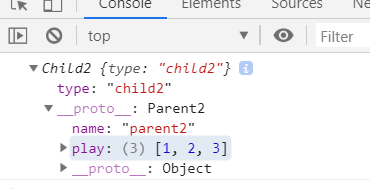

# 详谈js的类和继承

- 类与实例
  - 类的声明
  - 生产实例
- 类与继承
  - 如何实现继承
  - 继承的几种方式

### 类与实例

```javascript
  /**
  * 类的声明
  */
  function Animal(){
    this.name= 'name';
  }
  
  /**
  * es6中class的声明
  */
  class Animal2 {
    constructor(){
      this.name=name;
    }
  }

  /**
  * 实例化
  */
  console.log(new Animal(), new Animal2())
```
### 如何实现继承

#### 第一种借助构造函数实现继承

```javascript 
  function Parent1(){
      this.name='parent1';
    }
  Parent1.prototype.say=function(){};
  function Child1(){
    // 将父级构造函数的this指向子级
    Parent1.call(this); // apply
    this.type='child1';
  }
  console.log(new Child1(),new Child1().say())

```

在子类的函数体里执行父级的构造函数，同时改变函数运行的上下文环境（也就是this的指向），使this指向Child1这个类，从而导致了父类的属性都会挂载到子类这个类上去，如此便实现了继承。

但这种继承的方法有一个**缺点:**，它只是把父类中的属性继承了，但父类的原型中的属性继承不了。继续上面的代码

这种继承方式只改变父类构造函数在子类函数体中的指向，继承不了原型的属性。

#### 第二种是借助原型链实现继承

```javascript
  function Parent2(){
    this.name='parent2';
    this.play = [1, 2, 3];
  }
  function Child2(){
    this.type='child2';
  }
  Child2.prototype=new Parent2(); // 通过把Child2的原型指向Parent2来实现继承
  // Child2.prototype是子类构造函数的属性，这个属性是一个对象，可以任意赋值的，
  
  console.log(new Child2());
  var s1=new Child2();
  var s2=new Child2();
  console.log(s1.play, s2.play); 
  s1.play.push(4);
  // [1, 2, 3, 4] [1, 2, 3, 4]
```



可以看到在Child2的实例的__proto__的属性中有Parent2的属性，由此实现了Child2从Parent2的继承。

缺点：在一个类上实例两个对象，改变第一个对象的属性第二个对象也改变了，实例之间没有隔离。
因为，原型链上的原型对象是共用的。

#### 第三种组合继承
组合方式就是前两种方法组合而成的，上面两种方式都有不足，这种方式就解决了上面两种方式的不足。
```javascript
  function Parent3(){
    this.name='parent3';
    this.play=[1,2,3];
  }
  function Child3(){
    Parent3.call(this);// //子类里执行父类构造函数
    this.type='child3';
  }
  Child3.prototype=new Parent3(); //  //子类的原型指向父类
  var s3=new Child3();
  var s4=new Child3();
  s3.play.push(4)
  // console.log(s3.play, s4.play) // [1, 2, 3, 4]  [1, 2, 3]
```
这种方式的继承把构造函数和原型链的继承的方式的优点结合起来，并弥补了二者的不足，功能上已经没有缺点了。

但这种方法仍不完美，因为创建一个子类的实例的时候，父类的构造函数执行了两次。

每一次创建实例，都会执行两次构造函数这是没有必要的，因为在继承构造函数的时侯，也就是Parent3.call(this)的时候，parnet的属性已经在child里运行了，外面原型链继承的时候就没有必要再执行一次了。所以，接下来我们对这一方法再做一个优化。

Parent3.call(this) 和new parent3()执行两次
#### 组合继承优化1
 上面一种继承方式问题出在继承原型的时候又一次执行了父类的构造函数，所以优化就从这一点出发。

组合方式中为了解决借助构造函数继承(也就是本文中第一种)的缺点，父类的原型中的属性继承不了，所以才把子类的原型指向了父类。

但是父类的属性，在子类已经中已经存在了，子类只是缺少父类的原型中的属性，所以，根据这一点，我们做出优化。
```javascript

  function Parent4(){
    this.name='parent4';
    this.play=[1,2,3];
  }
  function Child4(){
    Parent4.call(this);
    this.type='child4';
  }
  Child3.prototype=Parent4.prototype; // 优化的点在这里
  var s5=new Child4();
  var s6=new Child4();
  s3.play.push(4)
  console.log(s5 instanceof Child4, s5 instanceof Parent4) // true false
  console.log(s5.constructor)
  //   function Child4(){
    // Parent4.call(this);
    // this.type='child4';
  // }

```
在这种继承方式中，并没有把直接把子类的原型指向父类，而是指向了父类的原型。这样就避免了父类构造函数的二次执行，从而完成了针对组合方式的优化。但还是有一点小问题，先看输出结果


可以看到s5是new Child4()出来的，但是他的constructor却是Parent4.

这是因为Child4这个类中并没有构造函数，它的构造函数是从原型链中的上一级拿过来的，也就是Parent4。所以说到这里，终于能把最完美的继承方式接受给大家啦。

#### 组合的完美优化
```javascript
  function Parent5(){
    this.name='parent5';
    this.play=[1,2,3];
  }
  function Child5(){
    Parent5.call(this);
    this.type='child5';
  }
  Child5.prototype=Object.create(Parent5.prototype);
  //把子类的原型指向通过Object.create创建的中间对象
  //把Child5的原型的构造函数指向自己
  Child5.prototype.constructor = Child5;
  var s7= new Child5();
console.log(s7 instanceof Child5, s7 instanceof Parent5)
console.log(s7.constructor);

```
 本例中通过把子类的原型指向Object.create(Parent5.prototype)，实现了子类和父类构造函数的分离，但是这时子类中还是没有自己的构造函数，所以紧接着又设置了子类的构造函数，由此实现了完美的组合继承。

