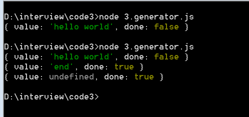

```
  Promise
  Generator
  async/await
```
## promise
> promise是什么

官网解释 promise 表示一个异步操作的最终结果。

翻译  **可以将promise理解为一个状态机**，它存在三种不同的状态，并在某一时刻只能有一种状态


- pending 表示还在执行
- resolved 执行成功
- rejected 执行失败

一个promise是对一个异步操作的封装，异步操作有等待完成、成功和失败三种可能的结果，对应了promise的三种状态。

promise的状态只能有pending转换位resolved或者pending转换为rejected，一旦状态转化完成就无法再改变。

假设我们用promise封了一个异步操作，那么当它被创建的时候就处于pending状态，当异步操作成功完成时，
我们将状态转换为resolved，如果执行中出现错误，将状态转换为rejected。
```javascript
var promise=new Promise(function(resolve,reject){
  // code
  if(){
    /*异步操作成功 */
    resolve(value)
  }else{
    reject(error)
  }
})
```
##### 使用then方法获取结果
```javascript
var fs=require('fs')
function readFile_promise(path){
  return new Promise(function(resolve,reject){
    fs.readFile(path, 'utf-8',function(err,data){
      if(data){
        resolve(data)
      }else{
        reject(err)
      }
    })
  })
}

var result=readFile_promise('./1.txt')
result.then(function(value){
  //success
  console.log('success', value)
},function(error){
  //failure
  console.log('failure',error)
})
// 将一个异步函数封装成promise，只要在回调函数中针对不同的返回结果调用resolve或者reject方法。

// resolve函数会在异步操作成功完成时被调用，并将异步操作的返回值作为参数传递到外部。
// reject是在异步操作出现异常时被调用，会将错误信息作为参数传递出去。
```
##### then方法的返回值
then方法总是返回一个新的promise对象，多次调用then方法，默认返回一个一个空的promise对象
使用return来来返回。
```javascript
var promise=readFile_promise('./foo.txt')
promise.then(function(value){
  //success
  console.log('success', value) // foo
  return readFile_promise('./bar.txt')
},function(error){
  //failure
  console.log('failure',error)
}).then(function(value){
  console.log('then', value) // bar
})
```
##### promise的执行
- 虽然我们是通过then方法来获取promise的结果，但是promise是当then方法调用之后才执行吗？
```javascript
var promise=new Promise((resolve, reject)=>{
  console.log('begin')
  resolve()
})

setTimeout(()=>{
  promise.then(()=>{
    console.log('end')
  })
},5000)
// 开始begin 5s后end
// 运行顺序是，当promise从被创建的那一刻起就开始执行了，then方法只是提供了访问promise状态的接口，与promise的执行无关。
```

### setTimeout和promise的执行顺序 
可以看出Promise比setTimeout()先执行。

因为Promise定义之后便会立即执行，其后的.then()是异步里面的微任务。
而setTimeout()是异步的宏任务。

需要注意的是Promise的实例化也属于同步任务，Promise的异步体现在then()和catch()中，
因此接下来会打印b，Promise调用then()方法，其回调函数会放入任务队列中等候，

待主线程的任务执行完毕，再执行then中的回调函数
```javascript
setTimeout(function(){
    console.log('1')
  })

  var p=new Promise(function(resolve,reject){
    console.log('2')
    resolve()
  })

  setTimeout(function(){
    console.log('3')
  })

  p.then(function(data){
  console.log('4')
}, function(err){

})
  // 2 4 1 3
  // 可以看出Promise比setTimeout()先执行。

// 因为Promise定义之后便会立即执行，其后的.then()是异步里面的微任务。
// 而setTimeout()是异步的宏任务。

// 需要注意的是Promise的实例化也属于同步任务，Promise的异步体现在then()和catch()中，
// 因此接下来会打印b，Promise调用then()方法，其回调函数会放入任务队列中等候，
// 待主线程的任务执行完毕，再执行then中的回调函数
```
##### promise 常用的api
- resolved 
- rejected
- all
- race 方法接收一个promise数组作为参数并返回一个新的promise，数组中的promise会同时开始执行，race返回的promise的状态有数组中率先执行完毕的promise的状态决定
- catch 执行出错可以使用throw关键字抛出错误，并使用catch方法进行捕获
```javascript
 // 如果有多个promise需要执行，可以使用promise.all()
// 方法统一声明，改方法可以将多个promise对象包装成一个promise
// 该方法接收一个数组作为参数，数据的元素如果不是promise对象，则回先调用resolve方法转换。
//  如果中间有一个promise状态是reject，那么转换后的promise也会变成reject，并且将错误信息传给catch方法
var promises=['foo.txt','bar.txt','baz.txt']
promises.map(function(path){
  // console.log(path)
  return readFile_promise(path)
})

Promise.all(promises).then(function(results){
  console.log(results) // [ 'foo.txt', 'bar.txt', 'baz.txt' ] 顺序排列的
}).catch(function(err){
  // 
})
```

##### 使用promise组织异步代码
```javascript
// 例子； 有三个文本文件需要顺序读取
var lists=['foo.txt','bar.txt','baz.txt']
var count=0;
readFile_promise('foo.txt').then(readCB).then(readCB).then(readCB);

function readCB(data){
  console.log(data) // foo bar baz
  if(++count>2){
    return
  }
  return readFile_promise(lists[count])
}
```
## Generator
Generator本质上是一个函数，它最大的特点就是可以被中断，然后恢复执行。

我们无法控制promise的执行，新建一个promise后，其状态自动转换为pending，同时开始执行，直到状态改变后我们才能进行下一步操作。

而generator函数不同，generator函数可以由用户执行中断或者恢复执行的操作，generator中断后可以转去做别的操作，然后再回过头来从中断的地方恢复执行。

### generator的使用
generator函数和普通函数再外表上最大的区别有两个
1. 在function关键字和方法名中间有个*
2. 方法体中使用yield关键字
```javascript
function *Generator(){
  yield 'hello world'
  return 'end'
}
var gen=Generator()
console.log(gen.next()) // { value: 'hello world', done: false }
console.log(gen.next()) // {value: 'end', done: true}
console.log(gen.next()) // {value: undefined, done: true}
```

#### generator的执行
在调用generator函数之后，该函数并没有立刻执行，函数的返回结果也不是字符串，而是一个对象，可以将该对象理解为一个指针，指向generator函数当前的状态。

在generator被调用后，指针指向方法体的开始行，当next方法调用后，该指针向下移动，方法也跟移动到下一个yield关键字，知道运行到方法的最后一行，
每次都返回一个包含执行信息的对象，包含一个表达式的值和一个标记执行状态的flag

#### generator中的错误处理
```
function *generator(){
  try{
    yield console.log('hello')
  }catch(e){
    console.log(e)
  }
  yield console.log('world')
  return 'end'
}
var gen = generator()

gen.next()
gen.throw('throw error')
// hello 
// throw error
// world
```
#### generator组织异步方式

我们之所以可以使用generator函数来处理异步任务，
1. generator函数可以中断和恢复执行，这个特性有yield关键字来实现。
2. generator函数内外可以交换数据，这个特性有next函数来实现。

==总结：==
generator函数处理异步操作的核心思想：

先将函数暂停在某处，然后拿到异步操作的结果，然后再把这个结果传到方法体内。

yield关键字后面除了通常的函数表达式外，比较常见的是后面跟的是一个promise，由于yield关键字会对其后面的表达式进行求值并返回，那么调用next方法时就会返回一个promise对象，我们可以调用其then方法，并在回调中使用next方法将结果传回generator。
```javascript
var fs=require('fs')
function readFile_promise(path){
  return new Promise(function(resolve,reject){
    fs.readFile(path, 'utf-8',function(err,data){
      if(data){
        resolve(data)
      }else{
        reject(err)
      }
    })
  })
}
function *gen(){
  var result=yield readFile_promise('foo.txt')
  console.log(result)
}
var g=gen()
var result=g.next()
result.value.then(function(data){
  g.next(data)
})

```

### async/await
async函数可以看做是自带执行器的generator函数
```javascript
  function *gen(){
    var result=yield readFile_promise('too.txt')
    ocnsole.log(result)
   
  }
```
用async函数改写的话，会变成如下的形式
```javascript
var asyncReadFile=async function(){
  var result1=await readFile_promise('./foo.txt')
  console.log(result1.toString()) // foo
}
```
形式上没有多大的变化，yield关键字换成了await，方法名字前面的*号变成了async关键字。

在使用上的一个区别是await关键字，await关键字后面往往是一个promise，
await的动作和它的名字含义相同，---等待后面的promise执行完成后再进行下一步操作。


await关键字后面往往是一个promise，如果不是就隐式调用promise.resolve来转换成一个promise。
await 等待后面的promise执行完成再进行下一步操作。
```javascript
var asyncReadFile=async function(){
  var result1=await readFile_promise('./foo.txt')
  console.log(result1.toString()) // foo
}
asyncReadFile()
```
##### async返回值
async函数总是会返回一个promise对象，如果return关键字后面不是一个promise，那么默认
调用promise。resolve方法进行转换。
```javascript
async function asyncFunc(){
  return 'hello Node'
}
asyncFunc().then(function(data){
  console.log(data) // hello Node
})
```
##### async函数的执行过程
1. 在async函数开始执行的时候回自动生成一个promise对象。
2. 当方法体开始执行后，如果遇到return关键字或者throw关键字，执行会立刻退出，
如果遇到await关键字则回暂停执行 await后面的异步操作结束后会恢复执行
3. 执行完毕，返回一个promise
```javascript
async function asyncFunc(){
  console.log('begin')
  return 'hello Node'
}
asyncFunc().then(function(data){
  console.log(data) // hello Node
  console.log('end')
})
// begin 
// hello 
// end
```

##### await
await 操作符的结果是由其后面promise对象的操作结果来决定的，如果后面promise对象变为resolved,
await操作符发返回的值就是resolve的值；如果promise对象的状态变成rejected，那么await也会抛出reject的值。
```javascript
async function readFile(){
  var result=await readFile_promise('./foo.txt')
  console.log(result) // foo
}
readFile()

// 等价于
readFile_promise('foo.txt').then(function(data){
  console.log(data) // foo
})
```
##### await于并行
await会等待后面的promise完成后再采取下一步动作，这意味着当多个await操作时，程序会便成完全的
串行操作。

当异步操作之间不存在依赖关系时，可以使用promise.all来实现并行。
```javascript
async function readFile(){
  const [result1, result2]=await Promise.all([
    readFile_promise('./foo.txt'),
    readFile_promise('./bar.txt')
  ])
  console.log(result1, result2) // foo bar
}
readFile()

// 等价于
function readFile(){
  return Promise.all([
    readFile_promise('./foo.txt'),
    readFile_promise('./baz.txt')
  ]).then((result)=>{
    console.log(result) // [ 'foo', 'baz' ]
  })
}
readFile()
```
### await 总结
> await关键字使用的一些关键点

- await关键字必须位于async函数内部
- await关键字后面需要是一个promise对象（不是的话就调用了resolve转换的）
- await关键字的返回结果就是在其后面promise执行的结果，可能是resolved或者rejected的值
- 不能在普通箭头函数中使用await关键字，需要在箭头函数前面加上async关键字。
- await用来串行地执行异步操作，想实现并行使用promise.all

### async函数 的缺点
- 假设我们有很多层的方法调用，最底层的异步操作被封装成了async方法，那么该函数的所有上层方法可能都要变成async方法。