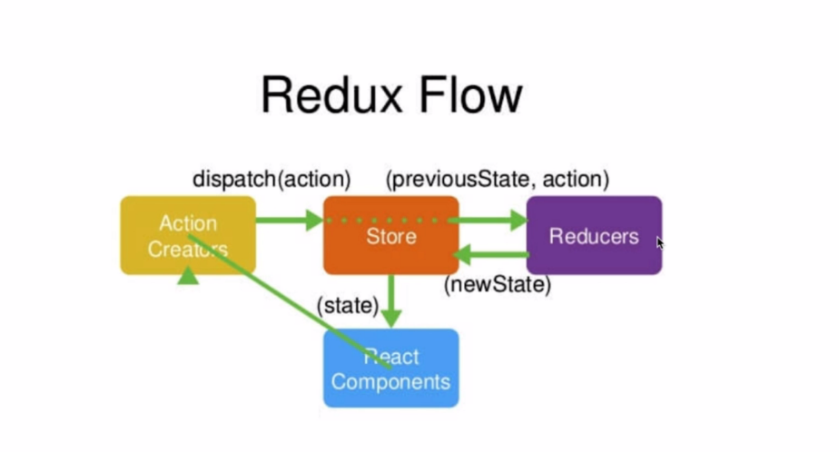
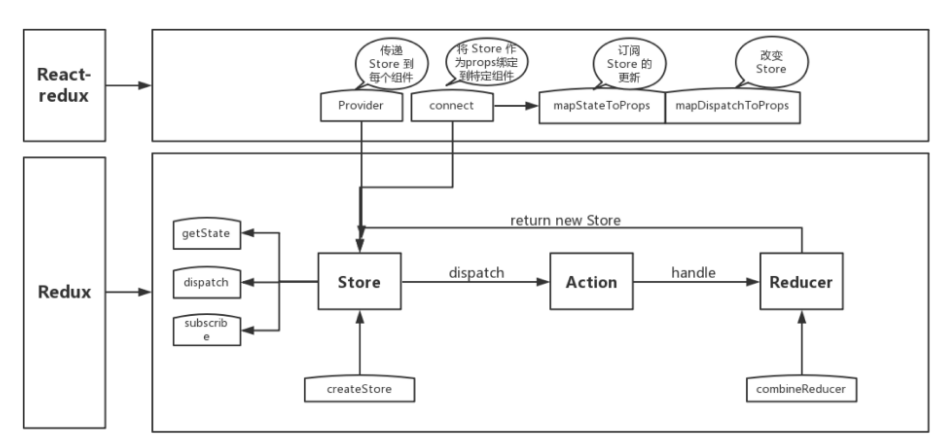

https://segmentfault.com/a/1190000016885832?utm_source=tag-newest

https://juejin.im/post/5b2215f76fb9a00e8f795cd1

## 1 React 中 keys 的作用是什么？
Keys 是 React 用于追踪哪些列表中元素被修改、被添加或者被移除的辅助标识。

在开发过程中，我们需要保证某个元素的 key 在其同级元素中具有唯一性。在 React Diff 算法中 React 会借助元素的 Key 值来判断该元素是新近创建的还是被移动而来的元素，从而减少不必要的元素重渲染。此外，React 还需要借助 Key 值来判断元素与本地状态的关联关系，因此我们绝不可忽视转换函数中 Key 的重要性。

使用key，给每一个子组件增加一个key属性，且这个key是唯一的，这个key不应该是数组的下标
## 2 调用 setState 之后发生了什么？

在代码中调用 setState 函数之后，React 会将传入的参数对象与组件当前的状态合并，然后触发所谓的调和过程（Reconciliation）。经过调和过程，React 会以相对高效的方式根据新的状态构建 React 元素树并且着手重新渲染整个 UI 界面。在 React 得到元素树之后，React 会自动计算出新的树与老树的节点差异，然后根据差异对界面进行最小化重渲染。在差异计算算法中，React 能够相对精确地知道哪些位置发生了改变以及应该如何改变，这就保证了按需更新，而不是全部重新渲染。
## 3 react 生命周期函数

## 4 shouldComponentUpdate 是做什么的，（react 性能优化是哪个周期函数？）
shouldComponentUpdate 这个方法用来判断是否需要调用 render 方法重新描绘 dom。因为 dom 的描绘非常消耗性能，如果我们能在 shouldComponentUpdate 方法中能够写出更优化的 dom diff 算法，可以极大的提高性能。
### 性能优化

## 为什么虚拟 dom 会提高性能?(必考)
https://www.jianshu.com/p/8c1505ebcf0e

虚拟 dom 相当于在 js 和真实 dom 中间加了一个缓存，利用 dom diff 算法避免了没有必要的 dom 操作，从而提高性能。

用 JavaScript 对象结构表示 DOM 树的结构；然后用这个树构建一个真正的 DOM 树，插到文档当中当状态变更的时候，重新构造一棵新的对象树。然后用新的树和旧的树进行比较，记录两棵树差异把 2 所记录的差异应用到步骤 1 所构建的真正的 DOM 树上，视图就更新了。

## react diff 原理（常考，大厂必考）
DOM DIFF 就是比较两个虚拟DOM的区别，实际上就是比较两个对象的区别。根据两个虚拟对象创建出补丁，描述改变的内容。将这个补丁用来更新DOM。


把树形结构按照层级分解，只比较同级元素。
给列表结构的每个单元添加唯一的 key 属性，方便比较。
React 只会匹配相同 class 的 component（这里面的 class 指的是组件的名字）
合并操作，调用 component 的 setState 方法的时候, React 将其标记为 dirty.到每一个事件循环结束, React 检查所有标记 dirty 的 component 重新绘制.
选择性子树渲染。开发人员可以重写 shouldComponentUpdate 提高 diff 的性能。
## React 中 refs 的作用是什么？
refs提供了一种访问DOM节点或在render方法中创建react元素的方法。
refs是react组件中非常特殊的props，可以附加在任何一个组件上。组件被调用时会新建一个改组件的实例，而refs就会指向这个实例。

1. 在React组件上添加refs
2. 使用回调函数的方式添加refs

在react组件上添加refs，获取到的是组件的实例。
而在原生DOM组件上添加refs获取的是DOM节点。

refs无法应用于函数组件（无状态组件），因为函数组件挂载事只是方法调用，没有新建实例。

## react中类组件和函数式组件的不同
类组件是以ES6的形式来创建react的组件的，

- 纯函数式定义的无状态组件
特点
- 组件不会被实例化，整体渲染性能得到提升
- 组件不能访问this对象
- 组件无法访问生命周期的方法
- 无状态组件只能访问输入的props，无副作用

使用场景

纯函数组件在大型项目中以简单的写法来分割原本庞大的组件。
## (组件的)状态(state)和属性(props)之间有何不同
State 是一种数据结构，用于组件挂载时所需数据的默认值。State 可能会随着时间的推移而发生突变，但多数时候是作为用户事件行为的结果。
Props(properties 的简写)则是组件的配置。props 由父组件传递给子组件，并且就子组件而言，props 是不可变的(immutable)。组件不能改变自身的 props，但是可以把其子组件的 props 放在一起(统一管理)。Props 也不仅仅是数据--回调函数也可以通过 props 传递。
### 受控组件
针对的是表单组件

表单元素依赖于状态，如`<input>, <textarea> <select>`这样的表单元素会维护自身的状态，并基于用户的输入来更新。当用户提交表单时，前面提到的元素的值将随表单一起被发送。但在 React 中会有些不同，包含表单元素的组件将会在 state 中追踪输入的值，并且每次调用回调函数时，如 onChange 会更新 state，重新渲染组件。一个输入表单元素，它的值通过 React 的这种方式来控制，这样的元素就被称为"受控元素"。

### react事件绑定this的几种方式
1. 在构造函数中绑定
```javascript
class Toggle extends React.Component {
  constructor(props) {
    super(props);
    this.state = {isToggleOn: true};

    // This binding is necessary to make `this` work in the callback
    this.handleClick = this.handleClick.bind(this);
  }

  handleClick() {
    this.setState(prevState => ({
      isToggleOn: !prevState.isToggleOn
    }));
  }

  render() {
    return (
      <button onClick={this.handleClick}>
        {this.state.isToggleOn ? 'ON' : 'OFF'}
      </button>
    );
  }
}

ReactDOM.render(
  <Toggle />,
  document.getElementById('root')
);
```
2. 使用class properties进行绑定
```javascript
class LoggingButton extends React.Component {
  // This syntax ensures `this` is bound within handleClick.
  // Warning: this is *experimental* syntax.
  handleClick = () => {
    console.log('this is:', this);
  }

  render() {
    return (
      <button onClick={this.handleClick}>
        Click me
      </button>
    );
  }
}
```
3. 使用箭头函数
```javascript
class LoggingButton extends React.Component {
  handleClick() {
    console.log('this is:', this);
  }

  render() {
    // This syntax ensures `this` is bound within handleClick
    return (
      <button onClick={(e) => this.handleClick(e)}>
        Click me
      </button>
    );
  }
}
```
这种方式会有性能问题，就是每次组件渲染时，onClick的回调函数都是不同的匿名函数，如果这个组件把回调函数通过props传递到其子组件，那么由于每次组件的渲染时，由于传递的props中的回调函数的变化，就会导致子组件额外渲染。
4. 使用bind()
```javascript
class LoggingButton extends React.Component {
  handleClick() {
    console.log('this is:', this);
  }

  render() {
    // This syntax ensures `this` is bound within handleClick
    return (
      <button onClick={this.handleClick.bind(this)}>
        Click me
      </button>
    );
  }
}
```
bind跟使用箭头函数一样，实际上每次组件渲染时都生成了新的回调函数。
建议使用构造函数中绑定或者使用class properties特性绑定，但bind和箭头函数在特殊场景下需要使用，即需要传递额外参数的情况。

**总结**
建议使用构造函数中绑定或者使用class properties特性绑定，但bind和箭头函数在特殊场景下需要使用，即需要传递额外参数的情况。
### 应该在 React 组件的何处发起 Ajax 请求
在 React 组件中，应该在 componentDidMount 中发起网络请求。这个方法会在组件第一次“挂载”(被添加到 DOM)时执行，在组件的生命周期中仅会执行一次。更重要的是，你不能保证在组件挂载之前 Ajax 请求已经完成，如果是这样，也就意味着你将尝试在一个未挂载的组件上调用 setState，这将不起作用。在 componentDidMount 中发起网络请求将保证这有一个组件可以更新了。
### 应该在 React 组件的何处发起 Ajax 请求
在 React 组件中，应该在 componentDidMount 中发起网络请求。这个方法会在组件第一次“挂载”(被添加到 DOM)时执行，在组件的生命周期中仅会执行一次。更重要的是，你不能保证在组件挂载之前 Ajax 请求已经完成，如果是这样，也就意味着你将尝试在一个未挂载的组件上调用 setState，这将不起作用。在 componentDidMount 中发起网络请求将保证这有一个组件可以更新了。
### React 中有三种构建组件的方式
React.createClass()、ES6 class 和无状态函数。
### 了解redux么，说一下redux吧


redux 是一个应用数据流框架，主要是解决了组件间状态共享的问题，原理是集中式管理，主要有三个核心方法，action，store，reducer，工作流程是 view 调用 store 的 dispatch 接收 action 传入 store，reducer 进行 state 操作，view 通过 store 提供的 getState 获取最新的数据。

reducer有两个参数是state，action 第一个是当前的状态，第二个是action是接收到的action对象。 reducer函数要做的事情，就是根据state和action的值产生一个新的对象返回，注意reducer必须是纯函数，也就是说函数的返回结果必须完全由参数state和action决定，而且不产生任何副作用，也不会修改参数state和action对象。

action必须由type属性，该属性指示正在执行的action的类型，必须将他们定义为字符串常量，
react-redux

react-redux 的两个主要的功能 connect 连接容器组件和傻瓜组件 provider 提供包含store的context。

connect是react-redux提供的方法，这个方法接受两个参数mapStateToProps和 mapDispatch-ToProps，执行结果依然是一个函数，说以才可以在后面又加一个圆括号，把connect函数执行的结果立刻执行，这一次参数是counter这个傻瓜组件。

- connect 
    - 把store上的状态转化为内层子组件的props
    - 把内层组件的用户动作转化为内层组件的props，其实就是一个映射关系，去掉框架，最后就是一个mapStateProps函数该做的事情。

Provider: Provider的作用是从最外部封装了整个应用，并向connect模块传递store
connect: 负责连接React和Redux


- 获取state: connect通过context获取Provider中的store，通过store.getState()获取整个store tree 上所有state
- 包装原组件: 将state和action通过props的方式传入到原组件内部wrapWithConnect返回一个ReactComponent对象Connect，Connect重新render外部传入的原组件WrappedComponent，并把connect中传入的mapStateToProps, mapDispatchToProps与组件上原有的props合并后，通过属性的方式传给WrappedComponent
- 监听store tree变化: connect缓存了store tree中state的状态,通过当前state状态和变更前state状态进行比较,从而确定是否调用this.setState()方法触发Connect及其子组件的重新渲染


### setState到底是异步还是同步?

先给出答案: 有时表现出异步,有时表现出同步

在获取ref的dom的时候用异步回调函数中可以拿到最新的dom
```javascript
 add(){
    this.setState({
      list:[...this.state.list,this.state.inputVal],
      inputVal:''
    },()=>{
      console.log(this.ul.querySelectorAll('li').length)
    })
    // setstate是异步，所以打印出来是2
    // 在setstate的异步回调中执行，就能拿到最新的
    // console.log(this.ul.querySelectorAll('li').length)
  }
```
### react组件通信
- 父传子
```javascript
1. 直接在子组件标签上传递属性
2. 在子组件内部通过 this.props 来访问
React 也是单向数据流
父组件数据的改变可以影响子组件，反之不会
// 父组件
<TodoMain todos={this.state.todos} foo="bar"></TodoMain>
// 子组件
// this.props.todo 子组件通过this.props接收， props接收的是一个对象

```
- 子传父
子组件调用父组件方法，父组件自己修改自己的状态
1. 在父组件中定义方法
2. 通过 Props Down 的形式将方法传递给子组件
3. 在子组件中通过 this.props.方法(参数) 来调用父组件的方法
```javascript
// 父组件
<TodoHeader addTodo={this.addTodo.bind(this)}></TodoHeader>
 addTodo(todotxt) {
    console.log('接收到了子传父数据', todotxt)
    const todos=this.state.todos.slice(0) // 备份数组
    todos.push({
      id:todos.length,
      title: todotxt,
      done:false 
    })
    this.setState({
      todos: todos
    })
  }

// 子组件
this.props.addTodo(inputText)

把没有问题的数据交给父组件，让父组件来决定如何使用这个数据
 在 React 中也是单向数据流，
 // 子组件是无法修改 props 数据的
如果需要修改，怎么办？
//在子组件中调用父组件的方法
//父组件在自己的方法中修改自己的 state => setState修改自己的状态
```

## react生命周期有哪些
##### 组件载入阶段：
componentWillMount:组件即将被装载、渲染到页面上，只调用1次
componentDidMount:组件真正在被装载之后，这里可以拿到真实DOM执行操作，只调用1次

##### 运行中状态：
componentWillReceiveProps(nextProps):组件将要接收到新属性的时候调用，在这时setState不会触发额外的render,因为此时已经有一次来自父组件引发的render了。

shouldComponentUpdate:组件接受到新属性或者新状态的时候（返回 false，接收数据后不更新，阻止 render ，后面的函数不会继续执行）
componentWillUpdate:组件即将更新不能修改属性和状态
componentDidUpdate:组件已经更新

##### 销毁阶段：
componentWillUnmount:组件即将销毁，这时候可以销毁绑定的事件监听或者定时器什么的。

有些好像把render也算进生命周期了：
render:组件在这里生成虚拟的 DOM 节点


## react怎么从虚拟dom中拿出真实dom
Refs 是 React 提供给我们的安全访问 DOM 元素或者某个组件实例的句柄。
我们可以为元素添加 ref 属性然后在回调函数中接受该元素在 DOM 树中的句柄，该值会作为回调函数的第一个参数返回。或者ref可以传字符串。
```
例如：<input ref=((input)=>{return this.name=input}) />， this.name.value取值
或者 <input ref="name" />，this.refs.name取值
```

## react组件之间如何通信
父子：父传子：props； 子传父：子调用父组件中的函数并传参；
兄弟：利用redux实现。 
## react的setState的原理及用法
当调用setState时，它并不会立即改变，而是会把要修改的状态放入一个任务队列，等到事件循环结束时，再合并指更新。

因此，setState有 异步，合并更新更新两个特性。

构造函数时唯一能够初始化this.state状态的地方

如果要修改使用this.setState(xx:xx) （接收的是一个对象）

如果状态更新是异步的，setState() 要接收一个函数
```javascript
this.setState((prevState, props) => ({
  counter: prevState.counter + props.increment
}));
```
## react与vue的对比
##### 相同点

都用虚拟DOM实现快速渲染
2. 我觉得父子，兄弟通信这些都挺像的，也都有自己的状态管理器：react=>redux, vue=>vuex
3. 都是轻量级框架
4. 现在vue也在渐渐吸收react中的一些语法，比如JSX语法，类式声明写法等
##### 不同点
React属于单向数据流——MVC模式，vue则属于双向——MVVM模式。
2. react兼容性比vue好，vue不兼容IE8.
3. react采用JSX语法，vue采用的则是html模板语法。
4. vue的css可以有组件的私有作用域，react则没有。
5. react比vue好的另一点是，它是团队维护，而vue属于个人，一般来说，大型项目更倾向于react，小型则用vue，当然这也不是绝对。
