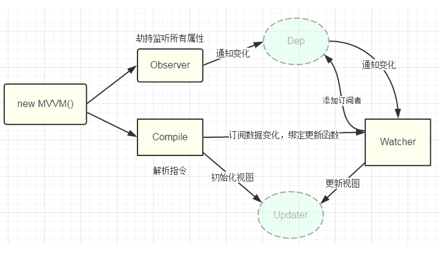

## vue双向数据绑定原理
把组件内定义的data传入vue实例，vue将遍历此对象所有属性，并使用Object.defineProperty把这些属性全部转为getter/setter。

每个组件实例都对应一个watcher实例，它会在组件渲染的过程中把“接触”过得数据属性记录为依赖。之后当依赖项的setter触发时，会通知watcher，从而使它关联的组件重新渲染。


vue.js 则是采用数据劫持结合发布者-订阅者模式的方式，通过Object.defineProperty()来劫持各个属性的setter，getter，在数据变动时发布消息给订阅者。
那么在设置或者获取的时候我们就可以在get或者set方法里假如其他的触发函数，达到监听数据变动的目的。


### 监测数据变化
无法检测到对象的属性添加和删除
```javascript
解决
set()
添加多个属性
使用Object.assign()
this.someObject = Object.assign({}, this.someObject, { a: 1, b: 2 })
```


```javascript

 <div id="app">
      <p id="name"></p>
    </div>
    
      var obj = {};
      Object.defineProperty(obj, "name", {
        get: function() {
          return document.querySelector("#name").innerHTML;
        },
        set: function(val) {
          document.querySelector("#name").innerHTML = val;
        }
      });
      obj.name = "Jerry";
      
```
### 数据劫持observer

observer用来实现对每个vue中的data中定义的属性循环用Object.defineProperty()实现数据劫持，以便利用其中的setter和getter，然后通知订阅者，订阅者会触发它的update方法，对视图进行更新。

在vue中v-model，v-name，{{}}等都可以对数据进行显示，也就是说假如一个属性都通过这三个指令了，那么每当这个属性改变的时候，相应的这个三个指令的html视图也必须改变，于是vue中就是每当有这样的可能用到双向绑定的指令，就在一个Dep中增加一个订阅者，其订阅者只是更新自己的指令对应的数据，也就是v-model='name'和{{name}}有两个对应的订阅者，各自管理自己的地方。每当属性的set方法触发，就循环更新Dep中的订阅者。


### 模板编译compile
编译元素和文本，最终渲染到页面中

compile需要做什么？

1.先把这些真实的dom移入到内存中的fragment文档碎片中
，（在内存中操作速度比较快）

2. 编译 提取想要的元素节点和文本节点v-model 双大括号，然后进行相关操作
3. 把编译好的fragment追加到页面中

**vue的原理**

是利用了Object.defineProperty()把data中的这些数据的每一个属性都定义了一个属性，都定义了getter和setter，让我们有机会去监听这些属性的变化，当这些属性发生变化时，我们去更新那些需要更新的地方去更新。

### 双向绑定的原理是什么？
使用vmodel的指令放在input这样的输入元素上，我们在编译的时候可以解析出这个v-model,然后在v-model所属的元素上加了事件监听，把v-model所指的事件回调函数作为input事件监听的回调函数去监听，这样的话如果input发生变化的时候，把最新的值放置在vue的实例上，因为vue的实例已经实现了数据的响应化。响应化的setter函数会触发界面中所有模型依赖的更新，通知那些依赖做更新和刷新操作，所以跟界面中跟这个数据相关的部分就更新了。